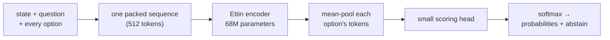

<div align="center">

# Anarkali

**A small model that makes typed decisions: fast, calibrated and open.**

Give it a situation, a question and the allowed answers. It returns a probability for every answer in one pass, on a plain CPU.

[](LICENSE)
[](https://huggingface.co/toufiqqureshi651/anarkali)
[](pyproject.toml)


<sub>[Watch with sound](assets/anarkali-launch.mp4) · 21 s</sub>

</div>

---

## Why Anarkali

- **More accurate than Jev** on the public typed-decisions benchmark (74.0% vs 72.7%), and **within 2.6 points of Laya** at a sixth of Laya's size.
- **Honest confidence.** Lowest calibration error of the three (ECE 0.135): its probabilities track how often it is actually right more closely than Laya's or Jev's.
- **Knows when to stay quiet.** Every answer carries an `abstain` flag. Answers above 0.7 probability are right 94.8% of the time.
- **Drop-in API.** Speaks the `/v1/systemone` format used by Jev and Laya: point an existing client at a new URL.
- **Runs anywhere.** A single 273 MB ONNX file. About 110 ms per decision on a laptop CPU and 14 ms on a T4 GPU. No PyTorch needed to serve.
- **Coding decisions built in.** CI failure triage, PR review triage and agent-step checks.

## Benchmark

2,000 held-out decisions from [`LocalLLaMA/typed-decisions`](https://huggingface.co/datasets/LocalLLaMA/typed-decisions) (revision `468b146`). The model was chosen on development data before the test split was opened.

| Model | Parameters | Accuracy ↑ | Calibration error (ECE) ↓ | Open weights |
|---|---:|---:|---:|:---:|
| Laya typed-decisions | 421M | **76.6%** | 0.213 | ✅ |
| **Anarkali** | **68M** | 74.0% | **0.135** | ✅ |
| Jev 1.13.0 | undisclosed | 72.7% | 0.144 | ❌ API only |

<sub>Laya and Jev figures are published by the Laya project; we did not run them. Laya and Anarkali are fine-tuned on this dataset, Jev is a general model. The dataset's own labelling teacher agrees with itself 73.5% of the time, so scores far above that fit its quirks rather than the task.</sub>

<details>
<summary><b>Breakdown by question type and workflow</b></summary>

| Slice | Decisions | Accuracy | ECE |
|---|---:|---:|---:|
| choice | 600 | 72.2% | 0.157 |
| noul (true / false) | 600 | 79.0% | 0.077 |
| score | 800 | 71.6% | 0.174 |
| invoice processing | 500 | 78.2% | 0.118 |
| security incidents | 500 | 74.4% | 0.168 |
| customer service | 500 | 73.8% | 0.141 |
| agent trace observability | 500 | 69.6% | 0.153 |

| Confidence threshold | Share of decisions answered | Accuracy on those |
|---|---:|---:|
| p ≥ 0.4 | 95% | 75.8% |
| p ≥ 0.5 | 69% | 82.7% |
| p ≥ 0.6 | 41% | 90.2% |
| p ≥ 0.7 | 24% | 94.8% |

Reversing the order of the options changes the top answer in only 2.6% of decisions.

</details>

## Quickstart

```bash
pip install "anarkali[onnx] @ git+https://github.com/ToufiqQureshi/anarkali"
```

```python
from anarkali import Engine

engine = Engine.load("toufiqqureshi651/anarkali")   # downloads once, runs on CPU

result = engine.predict(
    state={
        "invoice": "INV-2026-0917",
        "amount": 48120,
        "currency": "INR",
        "approval_policy": "Invoices above 40000 INR require finance approval before payment.",
    },
    questions={
        "needs_finance_approval": {
            "type": "noul",
            "instructions": "The invoice needs finance approval before payment.",
            "criteria": {
                "false": "The invoice can be paid without finance approval.",
                "true": "The invoice must be approved by finance before payment.",
            },
        },
    },
)
print(result["answers"]["needs_finance_approval"])
# {'type': 'noul', 'noul': 0.6658, 'confidence': 0.6658, 'abstain': False}
```

Three question types:

| Type | Use it for | Answer |
|---|---|---|
| `choice` | pick one of named options | `choice` + a probability per option |
| `noul` | true or false | `noul` = probability of true |
| `score` | pick a level on an ordered scale | `score` = expected level + a probability per level |

For `noul`, describe what true and false mean in `criteria`, as above. Without it the model leans towards false.

### From the command line

```bash
anarkali decide --model toufiqqureshi651/anarkali --request examples/requests/support_routing.json
```

### As a Jev-compatible server

```bash
pip install "anarkali[serve] @ git+https://github.com/ToufiqQureshi/anarkali"
anarkali serve --model toufiqqureshi651/anarkali --port 8000
curl -s localhost:8000/v1/systemone -d @examples/requests/support_routing.json
```

Set `ANARKALI_API_KEY` to require a bearer token.

## Coding decisions

| Workflow | Questions | Accuracy |
|---|---|---:|
| `coding_ci_failure` | cause · action · blocks_release · urgency | 85.0% |
| `coding_pr_triage` | review_decision · category · needs_security_review · risk | 78.8% |
| `coding_agent_step` | next_action · constraint_violation · progress | 70.0% |

Measured on 440 held-out cases (78.6% overall). These cases are synthetic and rule-labelled, so they show the workflows work, not how the model does on your repositories. A GitHub Action example lives in [`examples/github/`](examples/github/).

## How it works



All options are read together with the state, so the model compares them against each other in a single pass instead of scoring each one alone. Training targets are the teacher's full probability distributions, not hard labels, which is where the calibration comes from.

**Backbone bake-off** (7,880 training decisions, same recipe, Colab T4, chosen on 1,040 development decisions):

| Backbone | Parameters | Dev accuracy | Time per epoch |
|---|---:|---:|---:|
| [Ettin encoder 68M](https://huggingface.co/jhu-clsp/ettin-encoder-68m) | 68.2M | **79.8%** | 152 s |
| [MiniLM-L12-H384](https://huggingface.co/microsoft/MiniLM-L12-H384-uncased) | 33.4M | 76.4% | 98 s |
| DeBERTa-v3-small | 141M | failed to train | — |

## Reproduce

```bash
python scripts/prepare_typed_decisions.py --question-types choice,noul,score --output artifacts/typed-decisions-v2
python scripts/generate_coding_decisions.py --no-teacher
python scripts/merge_decision_sets.py
```

Then open [`notebooks/Anarkali_V3.ipynb`](notebooks/Anarkali_V3.ipynb) on a Colab T4 and press **Run All**. It trains the backbones, picks the winner on development data, evaluates it and writes a backup ZIP (about 30 minutes).

```bash
python scripts/evaluate_checkpoint.py --checkpoint best.pt --data artifacts/typed-decisions-v2 --output eval
python scripts/export_onnx.py --checkpoint best.pt --output release
```

The export only ships a graph that matches PyTorch on 200 development decisions (0 changed answers for the released fp32 model; every int8 variant failed and was dropped).

Tests: `python -m unittest discover -s tests`

### Relabel with open teachers

`scripts/relabel_with_teachers.py` relabels the training split with several open LLMs (for example Qwen and Mistral) through any OpenAI-compatible endpoint: vLLM on a free Kaggle or Colab GPU, Groq or OpenRouter. Each teacher is averaged over 3 option orders, rows the teachers disagree on go to `dropped-train.jsonl` for review, and the test split is copied byte for byte so benchmark scores stay comparable. Responses are cached, so a run cut short by a rate limit resumes where it stopped.

```bash
python scripts/relabel_with_teachers.py --input artifacts/typed-decisions-v2 --output artifacts/typed-decisions-v2-relabel \
  --teacher qwen=Qwen/Qwen3-30B-A3B-Instruct-2507@http://localhost:8000/v1 \
  --teacher mistral=<mistral-model-id>@https://openrouter.ai/api/v1 --rpm 20
```

API keys come from `<NAME>_API_KEY` (here `MISTRAL_API_KEY`). Check each model's licence before training on its outputs.

### Real agent traces for `coding_agent_step`

`scripts/import_agent_traces.py` turns public coding-agent runs into `coding_agent_step` decisions. It uses four Hugging Face datasets: nebius SWE-agent (CC-BY-4.0), nebius SWE-rebench OpenHands (CC-BY-4.0), nvidia SWE-Zero OpenHands (CC-BY-4.0) and Kwai-Klear SWE-smith (MIT).
- Labels are weak. Progress comes from the run's outcome, next action from what a successful agent did next, and violations from rule patterns.
- A share of steps get an injected rule-breaking action, such as a force push or editing tests.
- Splits are by GitHub issue.
- Relabel the result with teachers, and keep a hand-labelled set for the final score.

```bash
python scripts/import_agent_traces.py --per-source 2000 --output artifacts/agent-step-traces-v0
```

## Limits

- English only.
- Best on decisions that look like the training workflows: support routing, invoices, security incidents, agent traces and the coding workflows. On very different questions it is less reliable. Measure on your own data first.
- 512-token context; longer states are cut in the middle, keeping the start and end.
- A probability is not a permission. Keep a human or a verified rule in front of any irreversible action.

## Credits

Apache-2.0, see [LICENSE](LICENSE) and [NOTICE](NOTICE). Built on the [Ettin](https://huggingface.co/jhu-clsp/ettin-encoder-68m) encoder (JHU CLSP, MIT). Benchmark data: [`LocalLLaMA/typed-decisions`](https://huggingface.co/datasets/LocalLLaMA/typed-decisions) (Apache-2.0). The `/v1/systemone` format follows Jev's public API, and the typed-question design follows Jev and Laya. Anarkali never trains on Jev outputs.
