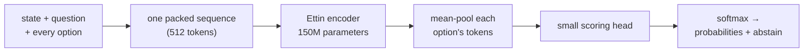

<div align="center">

# Anarkali

**A compact model that makes typed decisions: fast, calibrated and open.**

Give it a situation, a question and the allowed answers. It returns a probability for every answer in one pass, on a plain CPU.

[](LICENSE)
[](https://huggingface.co/toufiqqureshi651/anarkali)
[](pyproject.toml)


<sub>[Watch with sound](assets/anarkali-launch.mp4) · 21 s</sub>

</div>

---

## Web decisions (new direction)

Anarkali is being retrained as a cheap decision layer for web data work: scraping, crawling, price and competitor monitoring. It sits in front of your code or LLM and answers small typed questions about a page, such as `page_type`, `price_field` and `in_stock`.

- **Train it:** open [`Anarkali_Web_Train.ipynb`](Anarkali_Web_Train.ipynb) on Colab or Kaggle with a GPU and run all cells. It streams real pages from Common Crawl, labels them from their own schema.org markup, trains, scores against baselines on unseen sites, and exports ONNX.
- **Use the same page format at inference:** `from anarkali.web import page_state, PAGE_TYPE_QUESTION, IN_STOCK_QUESTION`.
- The dataset builder is [`scripts/build_web_decisions.py`](scripts/build_web_decisions.py). Labels are real but noisy (sites mark up schema.org imperfectly). No web-decision results are published yet.

## Why Anarkali

- **Ships with a local 150M ONNX release.** `release-150m/` contains the graph, tokenizer and config needed for CPU inference.
- **More accurate than Jev** on the public typed-decisions benchmark: the 0.3.0 68M baseline scores 74.0% vs Jev's 72.7%. The 150M release has not been scored on that benchmark yet.
- **Honest confidence.** The project optimizes calibration and selective accuracy, not just top-1 accuracy.
- **Knows when to stay quiet.** Every answer carries an `abstain` flag. On the 0.3.0 benchmark, answers above 0.7 probability were right 94.8% of the time.
- **Drop-in API.** Speaks the `/v1/systemone` format used by Jev and Laya: point an existing client at a new URL.
- **Type-safe by contract.** Every question and state payload is normalized and validated before inference, so the API behaves like a strict Jev/Laya-style decision schema rather than an ad hoc JSON bag.
- **Runs anywhere.** The released 150M ONNX graphs run without PyTorch. Large ONNX files are stored with Git LFS.
- **Hard routing benchmark.** 32 targeted cases in `benchmarks/anarkali-routing-v1/` track the failure modes the next release must fix.
- **Coding decisions built in.** CI failure triage, PR review triage and agent-step checks.

## Benchmarks

### Releases

| Release | Backbone | Parameters | Where | Status |
|---|---|---:|---|---|
| **150M** (current) | [Ettin encoder 150M](https://huggingface.co/jhu-clsp/ettin-encoder-150m) | 149M | [`release-150m/`](release-150m/), Hugging Face | ONNX FP32, parity passed |
| 0.3.0 | [Ettin encoder 68M](https://huggingface.co/jhu-clsp/ettin-encoder-68m) | 68M | superseded | public typed-decisions baseline |

150M release checks ([`release-150m/parity.json`](release-150m/parity.json)):

- PyTorch-to-ONNX parity on 200 rows: 0 changed answers, max probability drift 1.96e-6.
- CPU latency, batch 1, tokenization included: p50 446 ms, p95 704 ms. The 68M model measured 103 ms on a GitHub Actions runner, so expect roughly 4× the cost (different machines). int8 has not been validated yet.

### Hard routing suite (150M)

A targeted routing benchmark lives at [`benchmarks/anarkali-routing-v1/cases.jsonl`](benchmarks/anarkali-routing-v1/cases.jsonl). Current 150M result:

```text
32 hard routing cases
24 correct
75.0% accuracy
```

Run it with:

```bash
python scripts/evaluate_release_suite.py --model release-150m \
  --cases benchmarks/anarkali-routing-v1/cases.jsonl --min-accuracy 0.60
```

The hard suite focuses on the failure modes that matter most for improvement:

- one-customer product issue vs widespread incident
- product vs identity near-ties
- billing vs product entitlement confusion
- security vs identity edge cases
- temporal traps and long-context signal burial

### Real-world CI evaluation

The separate [`realworld-ci-v0` set](benchmarks/realworld-ci-v0/cases.jsonl) contains 65 hand-labelled CI failure cases. On 2026-10-03, the current 150M Hub model got **5/65 (7.7%)** correct on the `cause` question, compared with **75.4%** for an always-most-common-label baseline. Mean probability assigned to the correct label was 0.205; on this machine p50 latency was 1.58 s and p95 was 2.31 s per case. This is a poor result and means the model is **not ready to triage real CI failures automatically**. Keep this workflow in shadow mode or require human review; do not let it retry, block, or release code by itself.

Reproduce the evaluation and inspect every case in the generated report:

```bash
python scripts/realworld_benchmark.py \
  --cases benchmarks/realworld-ci-v0/cases.jsonl \
  --model anarkali=toufiqqureshi651/anarkali \
  --output artifacts/realworld-ci-v0
```

The 32-case routing suite and CI-failure benchmark cover different tasks and neither is large enough to guarantee performance on your data. Run both, add representative cases from your own workflow, and set a minimum acceptance threshold before deployment.

On these same scenarios, averaging 3 option orders raised CI `cause` accuracy to **8/65 (12.3%)**, still far below the majority baseline; hard routing was **23/32 (71.9%)**, below the default single-order result. It does not make the CI workflow production-ready. The two shipped ONNX graphs (`model.onnx` and `model.optimized.onnx`) returned the same top answers on all 97 cases across these suites.

### Public typed-decisions benchmark (0.3.0, 68M)

2,000 held-out decisions from [`LocalLLaMA/typed-decisions`](https://huggingface.co/datasets/LocalLLaMA/typed-decisions) (revision `468b146`). The model was chosen on development data before the test split was opened.

| Model | Parameters | Accuracy ↑ | Calibration error (ECE) ↓ | Open weights |
|---|---:|---:|---:|:---:|
| Laya typed-decisions | 421M | **76.6%** | 0.213 | ✅ |
| **Anarkali** | **68M** | 74.0% | **0.135** | ✅ |
| Jev 1.13.0 | undisclosed | 72.7% | 0.144 | ❌ API only |

<sub>This table describes the published 0.3.0 68M baseline. Laya and Jev figures are published by the Laya project; we did not run them. Laya and Anarkali are fine-tuned on this dataset, Jev is a general model. The dataset's own labelling teacher agrees with itself 73.5% of the time, so scores far above that fit its quirks rather than the task.</sub>

<details>
<summary><b>Breakdown by question type and workflow</b></summary>

| Slice | Decisions | Accuracy | ECE |
|---|---:|---:|---:|
| choice | 600 | 72.2% | 0.157 |
| noul (true / false) | 600 | 79.0% | 0.077 |
| score | 800 | 71.6% | 0.174 |
| invoice processing | 500 | 78.2% | 0.118 |
| security incidents | 500 | 74.4% | 0.168 |
| customer service | 500 | 73.8% | 0.141 |
| agent trace observability | 500 | 69.6% | 0.153 |

| Confidence threshold | Share of decisions answered | Accuracy on those |
|---|---:|---:|
| p ≥ 0.4 | 95% | 75.8% |
| p ≥ 0.5 | 69% | 82.7% |
| p ≥ 0.6 | 41% | 90.2% |
| p ≥ 0.7 | 24% | 94.8% |

Reversing the order of the options changes the top answer in only 2.6% of decisions.

</details>

## Quickstart

```bash
pip install "anarkali[onnx] @ git+https://github.com/ToufiqQureshi/anarkali"
```

```python
from anarkali import Engine

engine = Engine.load("toufiqqureshi651/anarkali")   # downloads once, runs on CPU
# Or use the checked-in local release:
# engine = Engine.load("release-150m")

result = engine.predict(
    state={
        "invoice": "INV-2026-0917",
        "amount": 48120,
        "currency": "INR",
        "approval_policy": "Invoices above 40000 INR require finance approval before payment.",
    },
    questions={
        "needs_finance_approval": {
            "type": "noul",
            "instructions": "The invoice needs finance approval before payment.",
            "criteria": {
                "false": "The invoice can be paid without finance approval.",
                "true": "The invoice must be approved by finance before payment.",
            },
        },
    },
)
print(result["answers"]["needs_finance_approval"])
# {'type': 'noul', 'noul': 0.6658, 'confidence': 0.6658, 'abstain': False}
```

The `.onnx` files in `release-150m/` are Git LFS objects. After cloning, run `git lfs pull` before loading the local release, or the graph will be a small pointer file.

Three question types:

| Type | Use it for | Answer |
|---|---|---|
| `choice` | pick one of named options | `choice` + a probability per option |
| `noul` | true or false | `noul` = probability of true |
| `score` | pick a level on an ordered scale | `score` = expected level + a probability per level |

This follows the Jev/Laya shape: `state` is JSON-like, each `question` has a strict `type`, `instructions`, and `criteria`, and invalid schemas are rejected before inference. For `noul`, describe what true and false mean in `criteria`, as above. Without it the model leans towards false.

### From the command line

```bash
anarkali decide --model toufiqqureshi651/anarkali --request examples/requests/support_routing.json
# or, from a cloned repo:
python -m anarkali decide --model release-150m --request examples/requests/support_routing.json
```

### As a Jev-compatible server

```bash
pip install "anarkali[serve] @ git+https://github.com/ToufiqQureshi/anarkali"
anarkali serve --model release-150m --port 8000
curl -s localhost:8000/v1/systemone -d @examples/requests/support_routing.json
```

Set `ANARKALI_API_KEY` to require a bearer token.

### Docker

With Docker Engine and the Compose plugin installed, start the CPU API:

```bash
export ANARKALI_API_KEY='replace-with-a-long-random-secret'
docker compose up --build -d
curl http://localhost:8000/health
curl http://localhost:8000/v1/systemone \
  -H 'Content-Type: application/json' \
  -H "Authorization: Bearer $ANARKALI_API_KEY" \
  --data-binary @examples/requests/support_routing.json
```

The first start downloads the public model from Hugging Face (about 1.2 GB) into a persistent Docker volume. For a private Hub model, also export `HF_TOKEN`. The default port is bound to `127.0.0.1`; the container runs as a non-root user. `docker compose logs -f` shows startup and request logs, and `docker compose down` stops the service without deleting the model cache. Set `ANARKALI_MODEL` to use another Hub repository, `ANARKALI_ORDERS` to trade speed for option-order averaging, or `ANARKALI_THREADS` to limit CPU threads. If exposing the API beyond localhost, keep `ANARKALI_API_KEY` set and put TLS/authentication at a trusted reverse proxy.

### Order averaging and calibrated temperatures

The packed encoder reads options at fixed positions, so reordering them can change a borderline answer. Pass `orders` to score each question under several cyclic option orders and average the probabilities. The cost is `orders` times the compute.

```python
engine = Engine.load("toufiqqureshi651/anarkali", orders=3)   # or: anarkali serve --orders 3
```

Measured with the 0.3.0 68M model on the typed-decisions test split, 2,000 decisions, CPU (the 150M release costs roughly 4× more per pass):

| `orders` | Accuracy | ECE | ms per decision |
|---:|---:|---:|---:|
| 1 (default) | 74.0% | 0.134 | 103 |
| 2 | 74.35% | 0.138 | 186 |
| 3 | 74.55% | 0.141 | 244 |

`anarkali.json` may also carry `temperature_by_type`: one temperature per question type, fitted on held-out data. For 0.3.0 the fitted values are 1.00 to 1.10 and do not improve test calibration, so the release ships without them. `scripts/benchmark_release.py` and the **Benchmark** workflow produce these numbers for any release.

## Coding decisions

| Workflow | Questions | Accuracy |
|---|---|---:|
| `coding_ci_failure` | cause · action · blocks_release · urgency | 85.0% |
| `coding_pr_triage` | review_decision · category · needs_security_review · risk | 78.8% |
| `coding_agent_step` | next_action · constraint_violation · progress | 70.0% |

Measured on 440 held-out cases (78.6% overall). These cases are synthetic and rule-labelled, so they show the workflows work, not how the model does on your repositories. A GitHub Action example lives in [`examples/github/`](examples/github/).

A Claude Code guardrail hook that asks `constraint_violation` before each tool call lives in [`examples/claude-code/`](examples/claude-code/). It is a demo until the model is trained on real agent traces.

## How it works



All options are read together with the state, so the model compares them against each other in a single pass instead of scoring each one alone. Training targets are the teacher's full probability distributions, not hard labels, which is where the calibration comes from.

The current release uses Ettin-150M; 0.3.0 used Ettin-68M, picked by the bake-off below.

**Backbone bake-off** (7,880 training decisions, same recipe, Colab T4, chosen on 1,040 development decisions):

| Backbone | Parameters | Dev accuracy | Time per epoch |
|---|---:|---:|---:|
| [Ettin encoder 68M](https://huggingface.co/jhu-clsp/ettin-encoder-68m) | 68.2M | **79.8%** | 152 s |
| [MiniLM-L12-H384](https://huggingface.co/microsoft/MiniLM-L12-H384-uncased) | 33.4M | 76.4% | 98 s |
| DeBERTa-v3-small | 141M | failed to train | — |

## Reproduce

```bash
python scripts/prepare_typed_decisions.py --question-types choice,noul,score --output artifacts/typed-decisions-v2
python scripts/generate_coding_decisions.py --no-teacher
python scripts/merge_decision_sets.py
```

Then open [`notebooks/Anarkali_V3.ipynb`](notebooks/Anarkali_V3.ipynb) or [`notebooks/Anarkali_V4.ipynb`](notebooks/Anarkali_V4.ipynb) on a Colab/Kaggle T4 and press **Run All**. The notebooks train, pick on development data, evaluate, and export ONNX.

```bash
python scripts/evaluate_checkpoint.py --checkpoint best.pt --data artifacts/typed-decisions-v2 --output eval
python scripts/export_onnx.py --checkpoint best.pt --output release
```

The export only ships a graph that matches PyTorch on 200 development decisions (0 changed answers for the released fp32 model; every int8 variant failed and was dropped).

Tests: `python -m unittest discover -s tests` (release benchmark only: `python -m pytest tests/test_release_benchmark.py`).

### Relabel with open teachers

`scripts/relabel_with_teachers.py` relabels the training split with several open LLMs (for example Qwen and Mistral) through any OpenAI-compatible endpoint: vLLM on a free Kaggle or Colab GPU, Groq or OpenRouter. Each teacher is averaged over 3 option orders, rows the teachers disagree on go to `dropped-train.jsonl` for review, and the test split is copied byte for byte so benchmark scores stay comparable. Responses are cached, so a run cut short by a rate limit resumes where it stopped.

```bash
python scripts/relabel_with_teachers.py --input artifacts/typed-decisions-v2 --output artifacts/typed-decisions-v2-relabel \
  --teacher qwen=Qwen/Qwen3-30B-A3B-Instruct-2507@http://localhost:8000/v1 \
  --teacher mistral=<mistral-model-id>@https://openrouter.ai/api/v1 --rpm 20
```

API keys come from `<NAME>_API_KEY` (here `MISTRAL_API_KEY`). Check each model's licence before training on its outputs.

### Real agent traces for `coding_agent_step`

`scripts/import_agent_traces.py` turns public coding-agent runs into `coding_agent_step` decisions. It uses four Hugging Face datasets: nebius SWE-agent (CC-BY-4.0), nebius SWE-rebench OpenHands (CC-BY-4.0), nvidia SWE-Zero OpenHands (CC-BY-4.0) and Kwai-Klear SWE-smith (MIT).
- Labels are weak. Progress comes from the run's outcome, next action from what a successful agent did next, and violations from rule patterns.
- A share of steps get an injected rule-breaking action, such as a force push or editing tests.
- Splits are by GitHub issue.
- Relabel the result with teachers, and keep a hand-labelled set for the final score.

```bash
python scripts/import_agent_traces.py --per-source 2000 --output artifacts/agent-step-traces-v0
```

### Training V4

[`notebooks/Anarkali_V4.ipynb`](notebooks/Anarkali_V4.ipynb) rebuilds the data from its sources and trains a bake-off on one T4. It runs the 0.3.0 recipe as the control against recipes using the V4 training options:
- Brier and ranked-probability losses
- option-order consistency
- layer-wise LR decay, warmup and EMA
- `--shared-option-positions`: every option starts at the same position ID, so the encoder cannot see the order of the options. The ModernBERT/Ettin local window is measured in positions too.

It picks on development data, then tests and exports.

### Distillation: more data, a 400M teacher, a 68M student

Anarkali is a typed + general decision model.

The V4 400M model reached 78.7% on typed-decisions but is six times slower than the 68M one. [`notebooks/Anarkali_Distill.ipynb`](notebooks/Anarkali_Distill.ipynb) moves its knowledge into the 68M model.
- `harvest_public_decisions.py` streams large public datasets into typed decisions. The default is permissive licences only: Civil Comments (CC0), Amazon polarity (Apache-2.0), CLINC150 (CC-BY-3.0), GoEmotions (Apache-2.0), CommonsenseQA (MIT) and deepset prompt-injections (Apache-2.0). Share-alike sets need `--allow-share-alike`.
- It writes two sets. `gold` holds the datasets' own human labels, soft where raters disagreed. `pool` holds the same texts with in-domain catalog questions for teachers to label.
- `label_with_checkpoint.py` labels any set with the 400M checkpoint, averaged over option orders.
- `relabel_with_teachers.py --brio-teacher NAME=MODEL@URL` adds a [colibri](https://github.com/JustVugg/colibri) Brio server as a teacher. It reads option probabilities from a large open model, one request per state.
- `generate_domain_decisions.py` writes new cases with an open model such as DeepSeek or Qwen, for the four benchmark workflows (`scripts/domains/benchmark.json`) and 20 general domains. Each prompt varies industry, region, tone, length and difficulty, steers toward rare answers, and asks for the generator's own probabilities, which are kept as one teacher.
- `combine_teachers.py` fits each teacher's temperature on the human-labelled calibration rows, then mixes the teachers with the human label.
- `train_anarkali.py --teacher-checkpoint` distils online: the student sees the same option order as the teacher (KL at a temperature plus option-vector matching). With `--dev-data`, each epoch is selected on the benchmark's own development cases.
- The notebook trains a no-teacher control next to the student, so the gain is measured, not assumed. Test splits and the real-world CI cases are opened only after that choice.

```bash
python scripts/harvest_public_decisions.py --output artifacts/public-decisions-v0 --max-per-source 50000
python scripts/label_with_checkpoint.py --checkpoint bb-ettin-400m-best.pt --input artifacts/public-decisions-v0/pool \
  --output artifacts/public-pool-t400 --name anarkali400m --fill-unlabelled
python scripts/combine_teachers.py --input artifacts/public-pool-t400 --output artifacts/public-pool-combined
```

## Limits

- English only.
- Best on decisions that look like the training workflows: support routing, invoices, security incidents, agent traces and the coding workflows. On very different questions it is less reliable. Measure on your own data first.
- 512-token context; longer states are cut in the middle, keeping the start and end.
- A probability is not a permission. Keep a human or a verified rule in front of any irreversible action.

## Credits

Apache-2.0, see [LICENSE](LICENSE) and [NOTICE](NOTICE). Built on the [Ettin](https://huggingface.co/jhu-clsp/ettin-encoder-68m) encoder (JHU CLSP, MIT). Benchmark data: [`LocalLLaMA/typed-decisions`](https://huggingface.co/datasets/LocalLLaMA/typed-decisions) (Apache-2.0). Distillation data: the public datasets listed above; a harvest writes their credits to `CREDITS.md`. The `/v1/systemone` format follows Jev's public API, and the typed-question design follows Jev and Laya. Anarkali never trains on Jev outputs.
